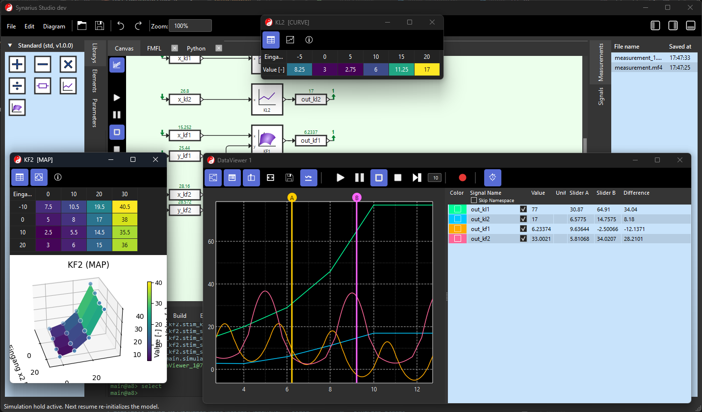

# synarius-studio (SN Studio)


Graphical simulation tool with a PySide6 GUI for Synarius.

**Python 3.11–3.14** is supported (see `requires-python` in `pyproject.toml`). Use a **virtual environment** and the **same** interpreter for `pip`/`python` and for your IDE.

**Contributing:** follow the **[Synarius programming guidelines](https://synarius-project.github.io/synarius-guidelines/programming_guidelines.html)** (HTML) and this repository’s **[CONTRIBUTING.md](CONTRIBUTING.md)**.



## Try out!
Download latest Windows installer (MSI): https://github.com/synarius-project/synarius-studio/releases/latest

## Vision

- Synarius Studio (SN Studio) is the graphical simulation modeling and visualization environment.
- The default language for code generation in SN Studio is Python.
- A clear separation is maintained:
  - Simulation backend: `synarius_core` (GUI-less framework)
  - GUI / modeling / visualization: `synarius_studio` (SN Studio)
- Over time, system modeling in SN Studio will be generalized, enabling "regional dialects" for graphical simulation.
  - This will be achieved by generalizing the underlying process-ontological concepts and adapting them for various use cases (MBSE, audio, microcontroller programming, dynamic system simulation, load flow optimization, general optimization, ...).
- The core system is open source. Extended commercial licensing models for add-on modules or enterprise requirements remain optional.

### Long-term perspective: Python simulation & optimization stacks

Over the long term, Synarius Studio may serve as a **graphical front-end** that prepares models, parameters, and experiment definitions and **delegates execution** to mature Python ecosystems—alongside or instead of bespoke paths in `synarius_core`. Examples of such stacks (not commitments; direction of travel):

| Stack | Typical role |
|-------|----------------|
| **SciPy** | Numerical methods and **ODE** integration (`scipy.integrate` and related APIs) for continuous-time dynamics. |
| **SimPy** | **Discrete-event**, process-based simulation (queues, resources, stochastic processes). |
| **Pyomo** | **Algebraic optimization** and constraint modeling (LP/MIP/NLP and related solvers). |

Integration would likely use the existing **plugin** and **controller** boundaries so that the GUI stays decoupled from any one backend. Nothing here replaces near-term roadmap items; it describes **architectural headroom** for MBSE-style and operations-research workflows.

## Goals (scope)

SN Studio is responsible for:

- Graphical modeling (including connector wiring and system structure).
- Dialect / syntax extensions for graphical simulation (e.g. variants of the MH syntax).
- Visualization and observation (e.g. graphical oscilloscopes for real-time observation).
- Project persistence (load/save) in cooperation with SN Core.
- Preparing simulation execution (delegation to SN Core).

## Roadmap

### 1.0

- Representation and connection of multiple FMUs via connectors (project modeling).
- Loading and saving projects (based on the core data structure).
- Stimulation / measurement setup in the GUI (UI drives the backend simulation).
- Saving measurement results (UI provides data visualization; backend stores results).
- Graphical oscilloscopes for real-time observation of the simulation.
- Integration of signal generators and measurement files (configured via the GUI).

### 1.X

- Modularization via plugin interfaces (GUI/workflow extensions, and later, optional core support).
- Extension of the original MH syntax.
- Arduino support as a plugin.
- Support for lookup tables and characteristic curves.
- Support for DCM and HDF5 files (optional: other formats like par [CANape], ASAM CDF/CDFX, CSV).

## Develop / Run (monorepo)

Studio declares **PySide6** and local siblings (`synarius-apps`, `synarius-core`) in `pyproject.toml`. Install from the **`synarius-studio`** directory so `pip` pulls those dependencies into **one** environment.

1. **Create and activate a venv** (examples):

   ```bash
   # Windows (adjust Python launcher if needed)
   py -3.12 -m venv .venv
   .venv\Scripts\activate
   ```

   ```bash
   # Linux / macOS
   python3 -m venv .venv
   source .venv/bin/activate
   ```

2. **Install Studio in editable mode** (from `synarius-studio/` with sibling checkouts `../synarius-core` and `../synarius-apps`):

   ```bash
   python -m pip install -U pip
   python -m pip install -e .
   ```

3. **Optional:** install **synarius-apps** editable as well when you change that package frequently (Studio already depends on it for shared UI, e.g. dataviewer, terminal console):

   ```bash
   python -m pip install -e ../synarius-apps
   ```

4. **Verify PySide6** with the same `python` you use to run the app (avoids “wrong venv” / typo issues):

   ```bash
   python -c "from PySide6.QtCore import Qt, QTimer; print('PySide6 OK')"
   ```

5. **Run** (after activation):

   ```bash
   run-synarius-studio
   ```

   Or module mode:

   ```bash
   python -m synarius_studio
   ```

6. **IDE:** set the workspace interpreter to this venv’s `python` (e.g. `.venv\Scripts\python.exe` on Windows, `.venv/bin/python` on Unix).

## Documentation

- Live docs: https://synarius-project.github.io/synarius-studio/
- Docs source: https://github.com/synarius-project/synarius-studio/tree/main/docs
- Long-term backend perspective (SciPy ODE, SimPy, Pyomo): see `docs/strategic_vision.rst` (Sphinx: *Strategic vision: Python backends*).

## Branching Strategy

This repository uses a simple branching model that fits a solo-developer phase and can be tightened later without changing the overall flow.

### Branch roles

- `main`: stable, release-ready branch
- `dev`: ongoing integration branch for daily development
- `feature/*`: short-lived branches for features
- optional short-lived branch prefixes: `fix/*`, `docs/*`, `refactor/*`

### Practical rules

1. Create new work branches from `dev`.
2. Merge `feature/*` (and optional `fix/*`, `docs/*`, `refactor/*`) into `dev`.
3. Merge `dev` into `main` when `dev` is stable and CI is green.
4. Create release tags (`v*`) from `main` only.
5. Direct pushes:
   - allowed on `dev` (for now)
   - avoided on `main` (use PR from `dev` to `main`)

### GitHub branch protection (recommended)

- `main`:
  - require pull request before merge
  - require status checks to pass
  - approvals not required (for now)
  - no force pushes, no branch deletion
- `dev`:
  - keep permissive for now (direct pushes allowed)
  - optionally block force pushes and deletion

