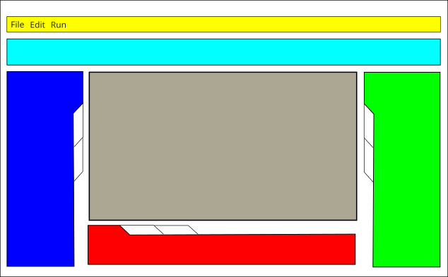

Main GUI Component Requirements
===============================

.. comp:: Main Window Structure
   :id: STUDIO-COMP-GUI-001
   :status: Must

   The main GUI includes at least:

   - main menu
   - main toolbar (open, save, and related actions)
   - vertically arranged resource tabs/tools area
   - drawing tool toolbar (create variable, connector, block, and related tools)
   - element list (switchable to model tree view)
   - console/logging area
   - experimentation/recording area
   - modeling canvas

.. comp:: Modeling edits via controller protocol
   :id: STUDIO-COMP-GUI-005
   :status: Must

   User-driven edits on the modeling canvas (and equivalent graph-editing entry points in the main window) change domain state only through the Synarius Core controller implementing the Controller Command Protocol; see STUDIO-ARCH-005.

.. comp:: Main Window + Mode-Dependent Tabs
   :id: STUDIO-COMP-GUI-002
   :status: Must

   The UI loads reliably and switches functionality context-dependently based on the active mode.

.. comp:: Simulation Context Menu
   :id: STUDIO-COMP-GUI-003
   :status: Should

   Direct Stimulate/Measure actions for variables are available in simulation context menus.

.. comp:: Efficient Runtime Visualization
   :id: STUDIO-COMP-GUI-004
   :status: Should

   Runtime value/status visualization updates efficiently and remains responsive.

Main GUI Layout (reference)
---------------------------

